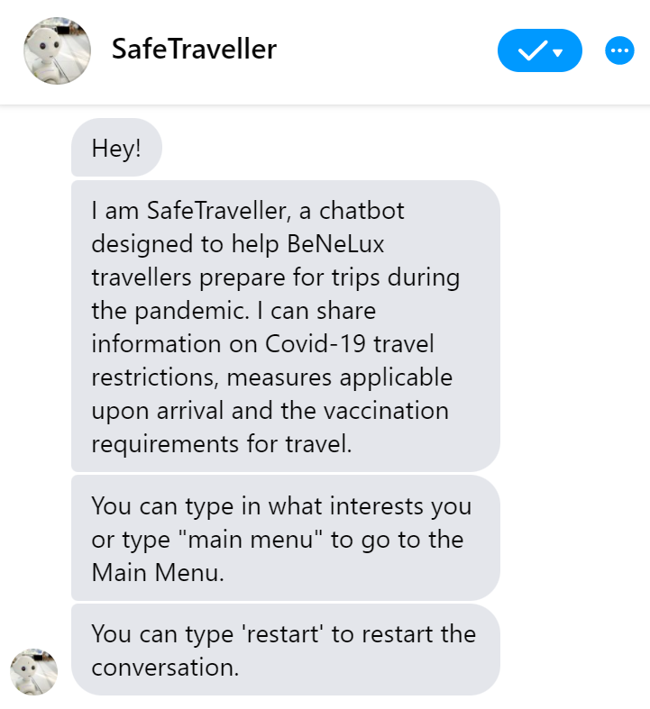

# SafeTraveller - A conversational assistant for BeNeLux travellers

This is a prototype of a chatbot presented at the BNAIC conference in November 2021.

The artificial conversational assistant SafeTraveller was created as a Bachelor student project in 2021. In the context of ever-changing COVID-19 regulations, the idea behind the project is to facilitate access to travel-related rules for people living in regions where cross-border traffic is essential. The current implementation covers travel regulations for the Benelux and the Greater Region countries and informs users in English.

The assistant is implemented using RASA and works in Facebook Messenger. The assistant works by filling slots with user travel details and querying the knowledge base of regulations to provide relevant information. The code for queries is implemented using Python framework. The regulations knowledge base is stored in a <em>knowledge_base_data.json</em> file in the <em>actions</em> directory.

Authors: Kristina Kudryavtseva, Sviatlana Höhn

# Application Snapshot

# Getting Started

## Installation
1. Download or clone this repository
2. Install [RASA](https://rasa.com/docs/rasa/installation/)
3. Navigate to the project directory in the terminal
4. To talk to the bot in the terminal run two commands in separate windows:
- <em>rasa shell</em>
- <em>rasa run actions</em>
5. To train a new model run
- <em>rasa train</em>

## Deploying the bot
There are several options for deploying the SafeTraveller bot:
- Deploy the bot in [RasaX](https://rasa.com/docs/rasa-x/) - a Conversation-Driven Development tool made by Rasa.
- Deploy the bot on you website or on a different channel (e.g. Messenger, Slack, etc.). The instructions are provided in [Rasa doccumentation](https://rasa.com/docs/rasa/messaging-and-voice-channels).

## Rasa
Please find all other relevant information in [RASA documentation](https://rasa.com/docs/).

# Future Work
In the future, we hope to be able to improve this prototype, fulfiling the following points:
- Automation of the COVID-19 regulations collection
- Regulations information in several languages (e.g. English, French, German)
- Handling of contradictions through logic
